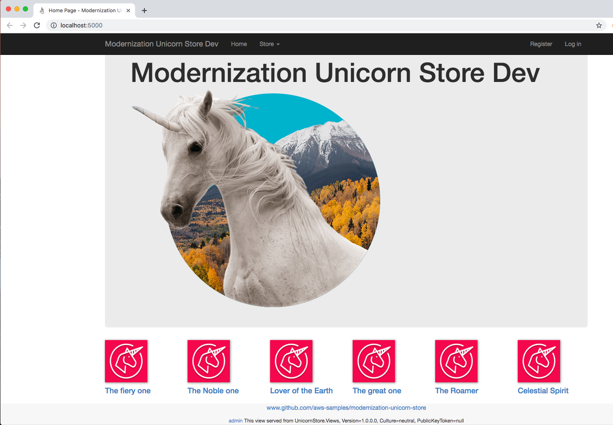

= modernization-unicorn-store

:imagesdir: static

AWS Sample Application for containerizing a .NET application

== License

This library is licensed under the Apache 2.0 License. 

== Prerequisites

To get started you will need:

- https://docs.docker.com/install/[Docker] installed on your local machine.
- https://docs.docker.com/compose/install/[Docker Compose]
- https://dotnet.microsoft.com/download[.NET Core 3]
- An IDE for building .NET Core applications such as https://visualstudio.microsoft.com/[Visual Studio]

Once you have the prerequisites installed on your local development machine you should be able to run the Unicorn Store locally either in your IDE or in a local container. Take the time to read https://docs.microsoft.com/en-us/aspnet/core/fundamentals/environments?view=aspnetcore-3.0[mutiple environments in ASP.NET Core] and https://docs.microsoft.com/en-us/aspnet/core/security/app-secrets?view=aspnetcore-3.0&tabs=windows[safe storage of app secrets in development in ASP.NET Core] before starting so you understand the various different configuration options.

== Introduction

The Unicorn Store demonstrates how to run a .NET Core application in a Docker container while connecting to a SQL backend (Database=UnicornStore) in https://aws.amazon.com/rds/[Amazon RDS]. The RDS credentials to the database in are stored in https://aws.amazon.com/secrets-manager/[AWS Secrets Manager] along with other sensitive information needed for the application to run. This allows the Unicorn Store application to safely connect to the database from the container without storing the secrets in a file on the container or in source control.

== Architecture overview

image::images/architecture.png[Unicorn Store Architecture]

== Workshop

Click link:content/prerequisites/_index.md[here] to start the workshop.

