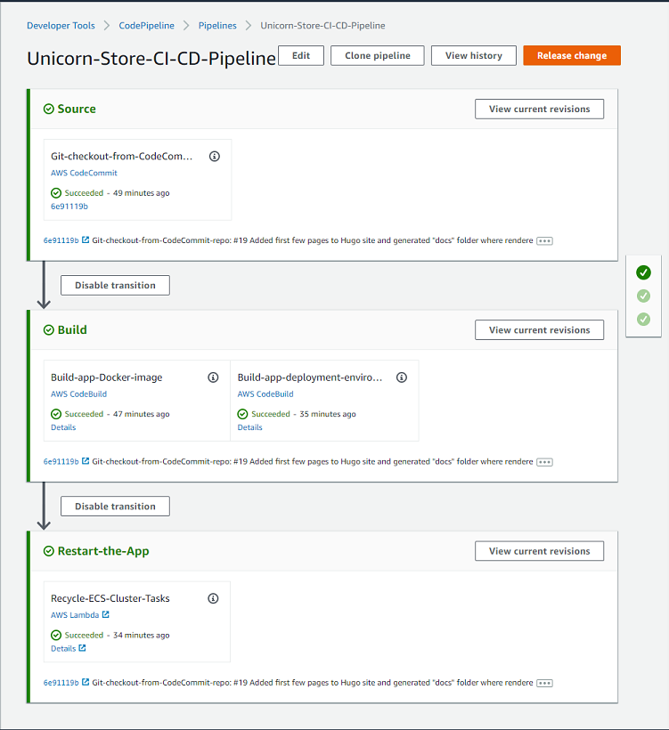

<!--
+++
title = "Project Structure"
date = 2019-10-14T14:11:33-04:00
weight = 50
pre = "<b>4. </b>"
+++
-->
Let's use the few minutes that it takes for the [application CI/CD pipeline infrastructure](./50-project-structure.html) to build, to get familiar with the structure of the project.

|     | Notes |
| --- | ----- |
|  | Solution contains one ASP.NET Core application project named `UnicornStore`, and three CDK-related projects: `CdkLib` - a C# class library project, containing reusable components shared between two executable CDK projects. |

The first of executable CDK projects is `CicdInfraAsCode` - the project we ran at the [previous step](./40-creating-ci-cd-pipeline.html) of the lab. "CicdInfraAsCode" is a C# Console project, generating CloudFormation templates from C# code, to build out AWS CodePipeline CI/CD infrastructure.

> The "CicdInfraAsCode" project contains a small *Node.js sub-project* in the "/assets/lambda/ecs-container-recycle" directory, which defines serverless AWS Lambda function used at the final stage of the CI/CD pipeline to recycle Linux containers, after new container image is built and made available to the application hosted by Amazon ECS.

Second executable CDK project is `ProdEnvInfraAsCode` - an C# Console project, generating CloudFormation templates that build out Unicorn Store application deployment environment in AWS cloud. This project will not be run from the Visual Studio because it will be run from the AWS CodePipeline to deploy Unicorn Store application packaged as a Linux container to Amazon Elastic Cloud Service (ECS), and to provision an RDBMS instance for the application from Amazon Relational Database Service (RDS).

### Unicorn Store ASP.NET Core Application Overview

A descendant from a well-known ASP.NET [Music Store sample](https://github.com/aspnet/AspNetCore/tree/v2.2.7/src/MusicStore), Unicorn Store is created to be a fairly typical ASP.NET Core 2.x MVC/Razor & Entity Framework Core application, combining UI, business logic and data access tiers in a single application, which is arguably a very typical design for most ASP.NET applications pre-dating microservices, [12-factor](https://www.12factor.net/)/cloud-native applications, and as such, suitable for modernization-focused labs.

> Something worth noting: *Unicorn Store application project has no dependencies on any AWS components*. The goal of the sample project is to represent an application that has *only open-source dependencies* and thus *can run anywhere*, from local developer workstation, to a proprietary datacenter, to any cloud service provider.

Unicorn Store data access tier is designed using *code-first* style, which uses C# code to define entity relationships and consequently database structure. This approach enables relatively easy swapping of database engines without drastically affecting the codebase. This module starts with the application codebase already retrofitted with pluggable RDBMS architecture and supporting SQL Server and PostgreSQL database engines out of the box.

This lab's focus is on adding support for MySQL database, which is a pretty simple task enabled by most of database engine configuration code abstracted away and already implemented. This relative simplicity will let us focus on the CDK-related tasks in later chapters.

### CDK Projects Overview

#### CdkLib

CdkLib, a shorthand for CDK library, contains modest amount of reusable C# code referenced by both executable .NET CDK projects. It's home to classes and helper methods reducing amount of boilerplate, making infrastructure build-out "meat" code in main projects more concise and expressive. It also serves as an illustration that CDK code is very easy to componentize and parameterize. 

One of the most useful bits in the CdkLib project is helper methods loading standard .NET Core `IConfiguration` from appsettings.json, environment variables, command line args and .NET Secret Manager, and deserialized into a strongly-typed class compatible with main CDK stack setting marshalling interface. This makes it ver easy to pass parameters to CDK projects via Environment Variable in CodePipeline, CodeBuild, and many other places.

#### CicdInfraAsCode

The more complex of all CDK projects, still with only about 300 lines of CDK code (plus another 100 lines of Node.js code), this C# Console app project produces three-stage project build and deployment pipeline, show below. 

The Build stage of the pipeline contains two *parallel* sub-stages: a) building application and packaging its artifacts as a [Docker](https://www.docker.com/resources/what-container) container image, and b) compiling and running second CDK project, the "ProdEnvInfraAsCode", which builds out deployment infrastructure for the Unicorn Store app.

The pipeline is not overly complicated and does not yet contain any quality gates, like testing, but it can serve as a springboard for an evolving CI/CD pipeline project.

TBD