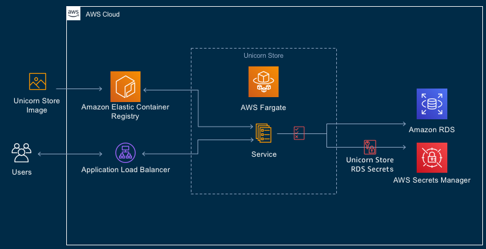

<!--
+++
title = "Project Structure"
date = 2019-10-14T14:11:33-04:00
weight = 50
pre = "<b>4. </b>"
+++
-->
Let's use the few minutes that it takes for the [application CI/CD pipeline infrastructure](./50-project-structure.html) to build, to get familiar with the structure of the project.

|     | Notes |
| --- | ----- |
|  | Solution contains one ASP.NET Core application project named `UnicornStore`, and three CDK-related projects: `CdkLib` - a C# class library project, containing reusable components shared between two executable CDK projects. |

The first of executable CDK projects is `CicdInfraAsCode` - the project we ran at the [previous step](./40-creating-ci-cd-pipeline.html) of the lab. "CicdInfraAsCode" is a C# Console project, generating CloudFormation templates from C# code for building out AWS CodePipeline CI/CD infrastructure.

> The "CicdInfraAsCode" project contains a small *Node.js sub-project* in the "/assets/lambda/ecs-container-recycle" directory, which defines serverless AWS Lambda function used at the final stage of the CI/CD pipeline to recycle Linux containers, after new container image is built and made available to the application hosted by Amazon ECS.

Second executable CDK project is `ProdEnvInfraAsCode` - an C# Console project, generating CloudFormation templates that build out Unicorn Store application deployment environment in AWS cloud. This project will not be run from the Visual Studio because it will be run from the AWS CodePipeline to deploy Unicorn Store application packaged as a Linux container to Amazon Elastic Cloud Service (ECS), and to provision an RDBMS instance for the application from Amazon Relational Database Service (RDS).

### Unicorn Store ASP.NET Core Application Overview

#### Application Project

A descendant from a well-known ASP.NET [Music Store sample](https://github.com/aspnet/AspNetCore/tree/v2.2.7/src/MusicStore), Unicorn Store is created to be a fairly typical ASP.NET Core 2.x MVC/Razor & Entity Framework Core application, combining UI, business logic and data access tiers in a single application, which is arguably a very typical design for most ASP.NET applications pre-dating microservices, [12-factor](https://www.12factor.net/)/cloud-native applications, and as such, suitable for modernization-focused labs.

Unicorn Store data access tier is designed using *code-first* style, which uses C# code to define entity relationships and consequently database structure. This approach enables relatively easy swapping of database engines without drastically affecting the codebase. This module starts with the application codebase already retrofitted with pluggable RDBMS architecture and supporting SQL Server and PostgreSQL database engines out of the box.

This lab's focus is on adding support for MySQL database, which is a pretty simple task enabled by most of database engine configuration code abstracted away and already implemented. This relative simplicity will let us focus on the CDK-related tasks in later chapters.

#### Application's Dockerfile

Located in the solution's root folder, and accessible from Visual Studio "Solution Items" folder, the *Dockerfile* defines how application is built and prepared for being published as a Docker container image. The Dockerfile is used by the AWS CodeBuild step of the application's CI/CD pipeline defined in the `CreateDockerImageBuildAction()` method in the CicdInfraAsCode.csproj.

### CDK Projects Overview

#### CdkLib

CdkLib, a shorthand for CDK library, contains modest amount of reusable C# code referenced by both executable .NET CDK projects. It's home to classes and helper methods reducing amount of boilerplate, making infrastructure build-out "meat" code in main projects more concise and expressive. It also serves as an illustration that CDK code is very easy to componentize and parameterize. 

One of the most useful bits in the CdkLib project is helper methods loading standard .NET Core `IConfiguration` from appsettings.json, environment variables, command line args and .NET Secret Manager, and deserialized into a strongly-typed class compatible with main CDK stack setting marshalling interface. This makes it ver easy to pass parameters to CDK projects via Environment variables in CodePipeline, CodeBuild and other places.

#### ProdEnvInfraAsCode

This project is a .NET CDK Console application project responsible for generating AWS CloudFormation templates that create Unicorn Store application hosting environment. The hosting environment, at the high level, consists of the Amazon [Elastic Container Service (ECS)](https://aws.amazon.com/ecs/) and [Relational Database Service (RDS)](https://aws.amazon.com/rds/). Under the hood the infrastructure built by this project is more complex, including various networking components, like a load balancer, virtual private cloud, subnets, security groups (firewall rules), roles and others.

However, despite the sophistication of the cloud infrastructure produced by this project, the amount and complexity of the code required to implement it is strikingly low. 

> ProdEnvInfraAsCode project is going to be run by the "build" part of the CI/CD pipeline, and *not manually* by developers, except for debugging purposes discussed in later chapters.

#### Architectural Diagram of the Application Hosting Environment

#### CicdInfraAsCode

The more complex of all CDK projects, still with only about 300 lines of CDK code (plus another 100 lines of Node.js code), this C# Console app project produces three-stage project build and deployment pipeline, show below. 

At high level, the CI/CD pipeline infrastructure includes Amazon [CodePipeline](https://aws.amazon.com/codepipeline/), [CodeCommit](https://aws.amazon.com/codecommit/) - a Git repository service, [CodeBuild](https://aws.amazon.com/codebuild/), [Elastic Container Registry (ECR)](https://aws.amazon.com/ecr/), and [Lambda](https://aws.amazon.com/lambda/) services.

The Build stage of the pipeline contains two *parallel* sub-stages: a) building application and packaging its artifacts as a [Docker](https://www.docker.com/resources/what-container) container image, and b) compiling and running second CDK project, the "ProdEnvInfraAsCode", which builds out deployment infrastructure for hosting Unicorn Store app. Having hosting infrastructure built as part of app's CI/CD pipeline may not be suitable for putting an application in production, but it could be quite useful for deploying application to a test environment. One can easily imagine a pipeline where the test environment containing large, pricey components is short-lived: provisioned, used only for the duration of an integration suite run, and then torn down to avoid an unnecessary spend.

The pipeline created by the CicdInfraAsCode is not overly complicated and does not yet contain any quality gates, like testing, but it can serve as a springboard for an evolving real-world CI/CD pipeline project.

The project contains a `Node.js sub-project` in the "/src/assets/lambda/ecs-container-recycle", which implements a *serverless AWS Lambda function* that is invoked by the final stage of the CI/CD pipeline to *restart the* ECS-hosted Unicorn Store *application* to load newly-minted application build.

The size of the Node.js code-base is fairly modest, and the code is split between the "cdklib" directory, where reusable and potentially boilerplate code is sequestered, and the "index.js" file, where the man logic of the function is implemented.

> At this point, please spend 5-10 minutes browsing through the UnicornStore solution to get familiar with where major parts of the codebase located.

Now that we've taken the tour of the project, let's move to the next chapter to see whether our CI/CD infrastructure has finished building.