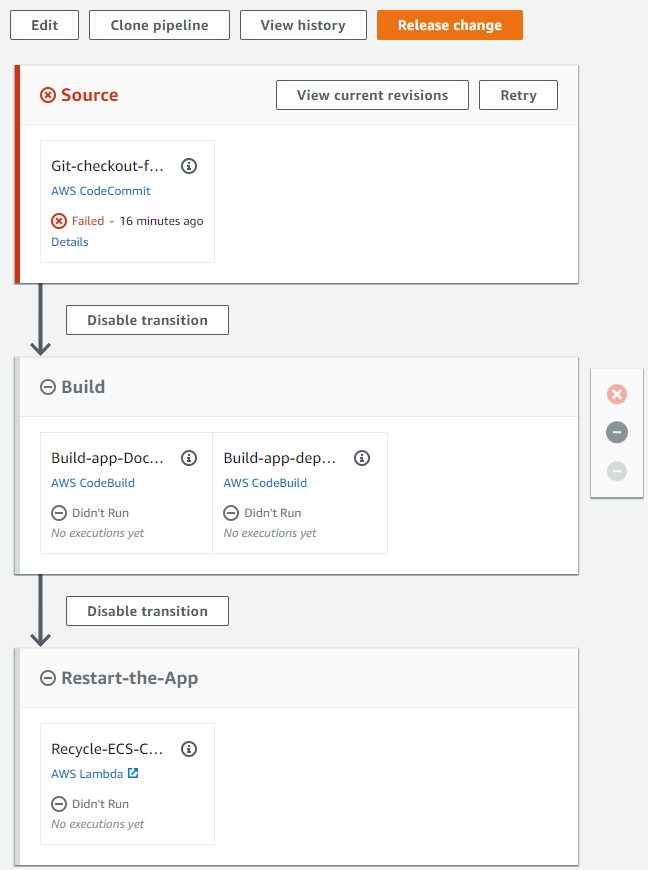

<!--
+++
title = "Starting Pipeline Build"
date = 2019-10-15T11:34:12-04:00
weight = 60
pre = "<b>5. </b>"
+++
-->

At this point the CI/CD pipeline cloud infrastructure, the build-out of which was [launched](./40-creating-ci-cd-pipeline.en.md#launching-ci-cd-pipeline-infrastructure-creation) two chapters back, should be completed.

First, please check the command prompt console where you ran `cdk deploy` for the "CicdInfraAsCode" project, to make there were no errors. You should see something like the following at the tail of the output after command has finished:
```
 30/30 | 1:10:43 PM | CREATE_COMPLETE      | AWS::CloudFormation::Stack  | Unicorn-Store-CI-CD-PipelineStack

 ✅  Unicorn-Store-CI-CD-PipelineStack

Stack ARN:
arn:aws:cloudformation:us-east-1:123456789012:stack/Unicorn-Store-CI-CD-PipelineStack/eee6e58c-6808-48a2-9885-c719f44dd8b6
```

Next, navigate to the [CodePipeline](https://console.aws.amazon.com/codesuite/codepipeline/home) in the AWS Console and observe "Unicorn-Store-CI-CD-Pipeline" in the list, showing the "Failed" status next to it. The pipeline is in the failed state because the source code of the Unicorn Store solution has not yet been pushed to the CodeCommit Git repository.

Please click on the "Unicorn-Store-CI-CD-Pipeline" link to see the brand-new pipeline:


### Starting the Pipeline: Pushing Source Code to CodeCommit

To trigger the build and deployment pipeline, all we need to do is to push the Unicorn Store to the CodeCommit Git repository just created.

> Following step: adding Git "remote" (alias) pointing to the CodeCommit repository, can be skipped if you are taking this lab at an AWS event, as the "aws" Git remote is already created on your dev VM.

Windows users, please use `Powershell` in *Administrator mode* for running commands that follow.

1. First, cd into the *root* of the Unicorn Store solution.
1. Create Git "remote" named "aws":

```ps
git remote add aws (aws codecommit get-repository --repository-name Unicorn-Store-Sample-Git-Repo | jq -r .repositoryMetadata.cloneUrlHttp)
```

1. Push the code to the CodeCommit repository:
```sh
git push aws cdk-module
```

1. Wait a few moments, and then go to the AWS [Console CodePipeline](https://console.aws.amazon.com/codesuite/codepipeline/home) page to observe CodePipeline build in-progress :


> First run of the pipeline is likely to take approximately `15 minutes`, primarily due to time required to provision application database and ECS-based application hosting infrastructure. Subsequent pipeline runs could finish in *under one minute* if no changes we introduced into the CDK-based infrastructure code.

