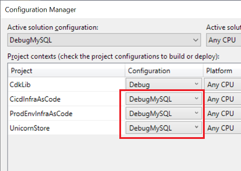

<!--
+++
title = "Updating Build Config"
menutitle = "Updating Build Configuration"
date = 2019-10-15T17:22:29-04:00
weight = 69
pre = "<b>7.2 </b>"
+++
-->

Before anything else, we need to update solution-to-project Build Configuration mapping.

|     | Notes |
| --- | ----- |
|  |  Please start with bringing up Solution Configuration Manager. |

Then select "DebugMySQL from the "Active solution configuration dropdown and change executable project configuration mapping from "DebugProject" to "DebugMySQL":

|     |       |  |
| --- | ----- | --- |
|   | Change to =>  |   |

Please do the same for the `ReleaseMySQL` solution configuration: map executable project context configuration to "ReleaseMySQL"

> FYI, each project that has "XxxxxMySQL" configuration, has `MYSQL` conditional compilation constant defined for the project:
> 
> 
> (Same is true for "XxxxxPostgres" and "XxxxxSqlServer": they have `POSTGRES` and `SQLSERVER` respective build constants defined.)
> 
> The process of creating "DebugMySQL" and "ReleaseMySQL" project build configurations is tedious and not very relevant for this module, so *these two project build configurations are provided out of the box*, rather than guiding lab participants here to create them manually.

Finally, please ensure *`DebugMySQL` solution configuration is selected* in the "Solution Configurations" dropdown.